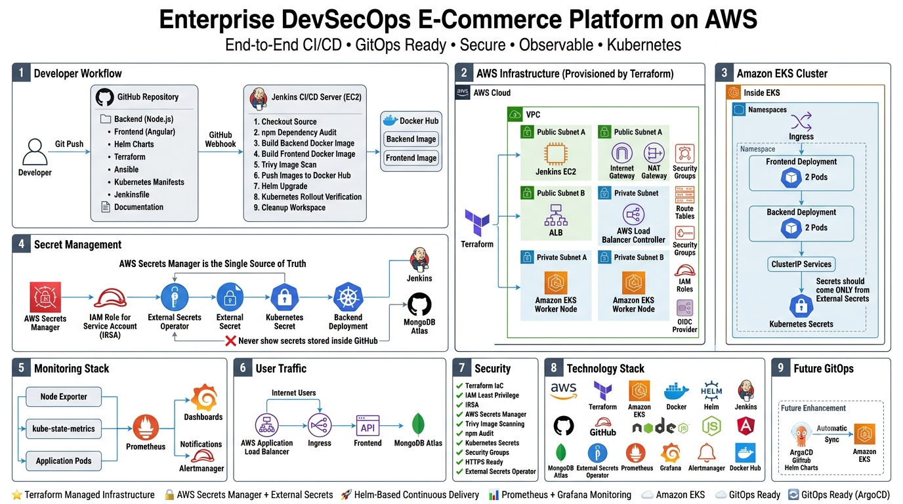

# ecommerce-devsecops-platform-
# 🚀 Cloud Native DevSecOps E-Commerce Platform on AWS


---


# 📌 Overview

This project demonstrates a **production-inspired Cloud Native DevSecOps platform** deployed on **Amazon Web Services (AWS)**.

The platform provisions the entire cloud infrastructure using **Terraform**, configures a CI/CD server using **Ansible**, builds and scans container images with **Docker** and **Trivy**, deploys applications to **Amazon EKS** using **Helm**, securely manages secrets with **AWS Secrets Manager** and the **External Secrets Operator**, and provides full-stack observability using **Prometheus**, **Grafana**, and **Alertmanager**.

The objective of this project is to showcase modern DevSecOps practices by combining Infrastructure as Code (IaC), Continuous Integration/Continuous Deployment (CI/CD), Kubernetes orchestration, cloud-native security, and monitoring into a single automated workflow.

---

# ✨ Features

- ✅ Infrastructure Provisioning with Terraform
- ✅ Jenkins CI/CD Pipeline
- ✅ Docker Image Build & Push
- ✅ Dependency Security Scan (npm audit)
- ✅ Container Image Vulnerability Scan (Trivy)
- ✅ Helm-based Kubernetes Deployments
- ✅ Amazon EKS
- ✅ AWS Load Balancer Controller
- ✅ AWS Secrets Manager Integration
- ✅ IRSA (IAM Roles for Service Accounts)
- ✅ External Secrets Operator
- ✅ Rolling Updates
- ✅ Prometheus Monitoring
- ✅ Grafana Dashboards
- ✅ Alertmanager
- ✅ Node Exporter
- ✅ Kube State Metrics

---

# 🏗 High-Level Architecture

> *(Architecture diagram will be added here.)*

```
Developer
    │
    ▼
 GitHub Repository
    │
    ▼
 Jenkins Pipeline
    │
    ├── npm audit
    ├── Docker Build
    ├── Trivy Scan
    ├── Docker Push
    └── Helm Deploy
          │
          ▼
      Amazon EKS
          │
     ┌───────────────┐
     │ Frontend Pods │
     └───────────────┘
             │
     ┌───────────────┐
     │ Backend Pods  │
     └───────────────┘
             │
      MongoDB Atlas

Secrets Flow

AWS Secrets Manager
        │
        ▼
External Secrets Operator
        │
        ▼
 Kubernetes Secret
        │
        ▼
 Backend Pods

Monitoring

Prometheus
     │
     ▼
 Grafana

Alertmanager
```

---

# ☁ AWS Infrastructure

Infrastructure is fully provisioned using **Terraform**.

## Components

- Amazon VPC
- Public Subnets
- Private Subnets
- Internet Gateway
- NAT Gateway
- Route Tables
- Security Groups
- IAM Roles
- EC2 (Jenkins)
- Amazon EKS
- Application Load Balancer
- AWS Secrets Manager

---

# 📁 Project Structure

```
ecommerce-devsecops-platform/

├── terraform/
│
├── ansible/
│
├── jenkins/
│   └── Jenkinsfile
│
├── helm-charts/
│   └── ecommerce/
│
├── microservices/
│   ├── backend/
│   ├── frontend/
│   └── k8s/
│
├── monitoring/
│
├── argocd/
│
└── README.md
```

---

# 🛠 Technology Stack

| Category | Technologies |
|-----------|--------------|
| Cloud | AWS |
| Infrastructure | Terraform |
| Configuration | Ansible |
| CI/CD | Jenkins |
| Containers | Docker |
| Registry | Docker Hub |
| Orchestration | Kubernetes (Amazon EKS) |
| Package Manager | Helm |
| Secrets | AWS Secrets Manager |
| Secret Sync | External Secrets Operator |
| IAM | IRSA |
| Monitoring | Prometheus |
| Dashboards | Grafana |
| Alerting | Alertmanager |
| Security | Trivy, npm audit |
| Database | MongoDB Atlas |
| Backend | Node.js |
| Frontend | Angular |

---

# 🔄 CI/CD Pipeline

Every push to GitHub triggers an automated Jenkins pipeline.

## Pipeline Stages

1. Checkout Source Code
2. Dependency Scan (npm audit)
3. Build Docker Images
4. Scan Images with Trivy
5. Push Images to Docker Hub
6. Deploy using Helm
7. Verify Kubernetes Rollout

```
GitHub

↓

Jenkins

↓

Checkout

↓

npm audit

↓

Docker Build

↓

Trivy Scan

↓

Docker Hub

↓

Helm Upgrade

↓

Amazon EKS

↓

Rollout Verification
```

---

# 🔐 Secrets Management

Instead of storing secrets inside Kubernetes manifests or Git repositories, this project integrates AWS Secrets Manager with Kubernetes using the External Secrets Operator.

## Secret Flow

```
AWS Secrets Manager

↓

IRSA

↓

SecretStore

↓

ExternalSecret

↓

Kubernetes Secret

↓

Backend Pods
```

Benefits:

- No hardcoded secrets
- IAM-based authentication
- Automatic secret synchronization
- Secure production-ready approach

---

# ☸ Kubernetes Deployment

The application is deployed using Helm.

## Namespaces

- ecommerce
- monitoring
- external-secrets

## Workloads

Frontend Deployment

- 2 Replicas

Backend Deployment

- 2 Replicas

Ingress

- AWS Application Load Balancer

---

# 📊 Monitoring

The monitoring stack includes:

- Prometheus
- Grafana
- Alertmanager
- Node Exporter
- Kube State Metrics

Collected Metrics:

- Cluster Health
- Node Metrics
- Pod Metrics
- Deployment Status
- Resource Usage
- Application Metrics

---

# 🛡 Security

Security is integrated into every stage of the pipeline.

## Dependency Scanning

- npm audit

## Container Security

- Trivy

## Secret Management

- AWS Secrets Manager

## IAM

- IAM Roles for Service Accounts (IRSA)

## Kubernetes

- Secrets injected using External Secrets Operator

---

# 🚀 Deployment

## Clone Repository

```bash
git clone https://github.com/your-username/ecommerce-devsecops-platform.git
```

---

## Provision Infrastructure

```bash
terraform init

terraform apply
```

---

## Configure Jenkins

```bash
ansible-playbook playbooks/jenkins.yml
```

---

## Deploy Monitoring

```bash
helm install kube-prometheus-stack
```

---

## Deploy External Secrets

```bash
helm install external-secrets
```

---

## Run Jenkins Pipeline

Push code to GitHub.

The pipeline automatically:

- Builds Images
- Scans Images
- Pushes Images
- Deploys to Amazon EKS

---

# 📷 Screenshots

To be added:

- AWS Architecture
- Jenkins Pipeline
- Docker Hub Images
- Trivy Scan
- EKS Cluster
- Kubernetes Pods
- ALB
- Grafana Dashboard
- Prometheus Targets
- AWS Secrets Manager
- External Secrets
- Terraform Apply

---

# 🔮 Future Improvements

Planned enhancements:

- Argo CD (GitOps)
- SonarQube
- OWASP Dependency Check
- Slack Notifications
- Route53
- HTTPS (AWS ACM)
- Loki
- Promtail
- OpenTelemetry
- Jaeger
- Horizontal Pod Autoscaler
- Cluster Autoscaler
- Multi-environment Deployments (Dev / Stage / Prod)

---

# 📚 Lessons Learned

Throughout this project, I gained practical experience with:

- Infrastructure as Code
- Kubernetes Administration
- CI/CD Automation
- Cloud Security
- IAM Best Practices
- Secret Management
- Kubernetes Monitoring
- Production Deployment Strategies
- AWS Networking
- Helm Package Management

---

# 👨‍💻 Authors

Ahmed Kamel and Omar Hesham

DevOps Engineers

DevOps | Cloud | Kubernetes | AWS | Linux

LinkedIn:
*(https://www.linkedin.com/in/eng--ahmed-kamel/)*
*(https://www.linkedin.com/in/omar-hesham2002/)*

GitHub:
*(https://github.com/eng-Ahmed-Kamel)*
*(https://github.com/OmarHesham249)*


---

# ⭐ Support

If you found this project helpful, consider giving it a ⭐ on GitHub.
